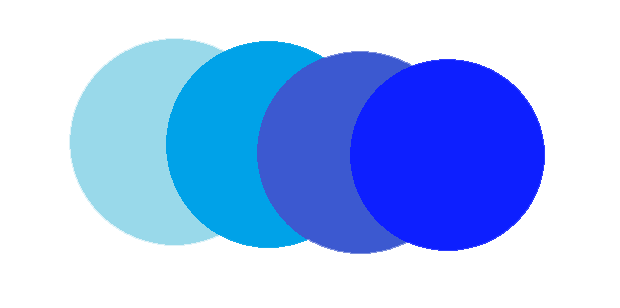

<h1 align="center">
   
  Momentum Dummy AI
</h1>

  
  
  
  
  

This is a dummy AI to replicate the behavior of the real AI.  
It is merely a placeholder to be used for development purposes only.